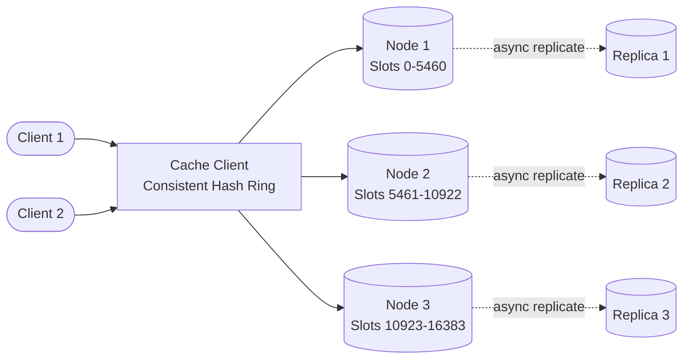

## Requirements

**Functional**:
- GET(key) → value
- PUT(key, value, ttl)
- DELETE(key)
- Cache evicts entries when full (LRU)

**Non-functional**:
- 1M read QPS, 100K write QPS
- < 10ms latency for all operations (p99)
- 99.99% availability
- Horizontal scalability (add nodes without downtime)

---

## Capacity Estimation

| Metric | Value |
|--------|-------|
| Keys | 100M |
| Average value size | 1 KB |
| Total data | ~100 GB |
| Read QPS | 1M |
| Write QPS | 100K |
| Nodes needed (100 GB / 25 GB per node) | ~4 nodes minimum |

---

## High-Level Architecture



---

## Core Design: Consistent Hashing

### Naive Modulo Sharding Problem

If you have 4 nodes: `node = hash(key) % 4`

Add a 5th node → formula changes to `% 5` → almost all keys hash to different nodes → massive cache miss storm.

### Consistent Hashing

Place nodes on a virtual ring (0 to 2^32). Each key maps to the first node clockwise from `hash(key)`.

```
Ring (0 to 2^32-1):
         Node A (hash=100)
           /
  Node D  ---- Ring ----  Node B (hash=800)
           \
         Node C (hash=600)

Key X (hash=400) → goes to Node B (next clockwise)
Key Y (hash=700) → goes to Node C (next clockwise)
```

**Adding a node**: Only keys between the new node and its predecessor need to move. Typically ~1/N of all keys.

**Removing a node**: Only that node's keys move to the next node.

### Virtual Nodes

Without virtual nodes, nodes may be unevenly positioned on the ring → uneven load.

**Solution**: Each physical node gets M virtual node positions (e.g., M=150).

```
Physical node A → virtual positions: 50, 300, 750, 1100, 2000 ... (150 positions)
Physical node B → virtual positions: 100, 450, 900, 1400, 2200 ... (150 positions)
```

Result: Keys are spread evenly across all physical nodes.

---

## Cache Node Architecture

Each node in the cluster is essentially an in-memory key-value store:

```
Cache Node:
  ├── Hash Map: key → (value, expiry_time, LRU_position)
  ├── LRU List: doubly linked list ordered by access time
  ├── Eviction thread: runs when memory > 90% capacity
  └── TCP server: accepts GET/PUT/DELETE requests
```

### LRU Eviction

```python
class LRUCache:
    def __init__(self, capacity_bytes):
        self.cache = {}  # key → Node(value, expiry)
        self.lru = DoublyLinkedList()
        self.capacity = capacity_bytes
        self.used = 0

    def get(self, key):
        if key not in self.cache:
            return None
        node = self.cache[key]
        if node.expiry < time.time():
            self.delete(key)
            return None
        self.lru.move_to_front(node)  # Mark as recently used
        return node.value

    def put(self, key, value, ttl):
        size = sys.getsizeof(value)
        while self.used + size > self.capacity:
            evicted = self.lru.pop_tail()  # Remove least recently used
            self.used -= sys.getsizeof(evicted.value)
            del self.cache[evicted.key]

        node = Node(key, value, expiry=time.time() + ttl)
        self.cache[key] = node
        self.lru.push_front(node)
        self.used += size
```

---

## Client Library (Consistent Hash Router)

The client routes requests to the correct node using the consistent hash ring:

```python
class CacheClient:
    def __init__(self, nodes, virtual_nodes=150):
        self.ring = ConsistentHashRing(nodes, virtual_nodes)

    def get(self, key):
        node = self.ring.get_node(key)
        return node.get(key)

    def put(self, key, value, ttl=3600):
        node = self.ring.get_node(key)
        node.put(key, value, ttl)

class ConsistentHashRing:
    def get_node(self, key):
        hash_val = self.hash(key)
        # Find first virtual node >= hash_val on ring
        # Return the physical node that virtual node belongs to
```

---

## Hot Key Problem

A "hot key" is a key accessed far more frequently than others. A single cache node handling all requests for that key becomes a bottleneck.

**Example**: A breaking news article's view count — 1M reads/sec all hitting one node.

**Solutions**:

### 1. Key Replication

Store hot keys on multiple nodes. On read, pick a random node from the replicas.

```python
# For hot keys: replicate across K nodes
def get_hot_key(key):
    replicas = ring.get_n_nodes(key, n=3)
    node = random.choice(replicas)  # Load spread across 3 nodes
    return node.get(key)
```

### 2. Local In-Process Cache (L1 Cache)

Keep a tiny in-process LRU cache for the hottest keys:

```python
class TwoTierCacheClient:
    def __init__(self):
        self.l1 = LocalLRUCache(max_items=1000, ttl=1)  # 1-second TTL
        self.l2 = DistributedCacheClient(...)

    def get(self, key):
        value = self.l1.get(key)
        if value is None:
            value = self.l2.get(key)
            if value:
                self.l1.put(key, value)  # Populate L1
        return value
```

A 1-second local cache + 100 replicas of the cache service = 100K requests/sec becomes ~100 requests/sec to the distributed cache.

---

## Replication for Availability

Single-node cache: if node fails, all keys on that node are cache misses until the node recovers.

**Solution**: Primary-replica per shard.

```
Each consistent hash position → Primary node
                                 → Replica 1
                                 → Replica 2

Writes: Primary → async replicate to replicas
Reads: Round-robin across primary + replicas
```

**Consistency**: Accept eventual consistency for cache (stale data acceptable for ~100ms). Cache misses are safe (fall back to DB), stale data is a temporary issue.

---

## Cache Invalidation

When the underlying data changes:
- **TTL expiry**: Data becomes stale and is evicted naturally. Simple, but might serve stale for TTL duration.
- **Active invalidation**: On write to DB, send DELETE to cache. Requires coordination.

```python
# After DB write:
def update_user(user_id, data):
    db.update(user_id, data)
    cache.delete(f"user:{user_id}")
    # Next read will be a cache miss → fetch fresh from DB → populate cache
```

**Invalidation challenge**: Race condition between delete and re-population. Use short TTLs (< 60s) for mutable data to bound staleness.

---

## Trade-offs

| Decision | Trade-off |
|----------|-----------|
| Consistent hashing | ~1/N remapping on scale vs full remapping with modulo |
| Virtual nodes | More even distribution vs memory overhead |
| LRU eviction | Good for temporal locality vs high memory for LRU list |
| Async replication | Low write latency vs brief inconsistency between nodes |
| Hot key replication | Manual detection needed vs prevents single-node bottleneck |

---

## Interview Summary

1. **Consistent hashing** with virtual nodes distributes keys evenly and minimizes remapping on scale
2. **LRU eviction** with TTL-based expiry per node; evict least-recently-used when full
3. **Hot key mitigation**: replicate across multiple nodes + in-process L1 cache
4. **Primary-replica** per shard for availability (read scale + failover)
5. **Client library** encapsulates ring logic, health checking, retries
