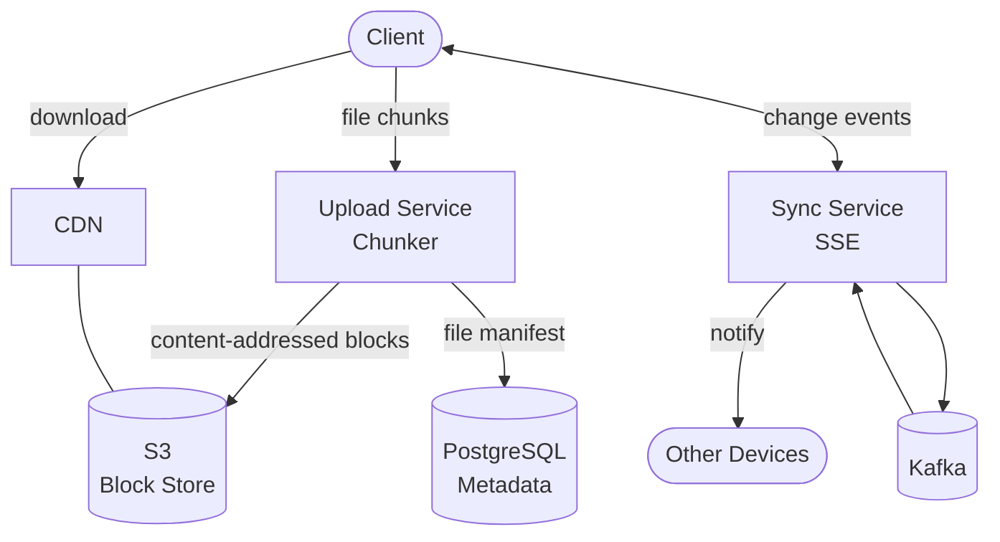

## Requirements

**Functional**:
- Upload, download, delete, and organize files and folders
- Sync files across multiple devices
- File versioning (history, restore previous versions)
- Share files and folders with others (view/edit permissions)
- Work offline and sync when reconnected

**Non-functional**:
- 1B+ users, 15B+ files stored
- Max file size: 5 TB
- Upload/download anywhere in the world
- 99.99% durability (essentially never lose a file)

---

## Capacity Estimation

| Metric | Value |
|--------|-------|
| Storage total | ~1 exabyte (1,000 PB) |
| New files/day | ~1B files |
| Average file size | ~500 KB |
| Daily new storage | ~500 TB/day |
| Metadata records | 15B+ file rows |

---

## High-Level Architecture



---

## Deep Dive: File Chunking

Large files are split into smaller **blocks/chunks** (4–8 MB).

### Why Chunking?

1. **Resumable uploads**: If connection drops at block 50 of 100, resume from block 51
2. **Deduplication**: If block content is identical to an existing block, don't store it again
3. **Delta sync**: When a file changes, only upload the changed blocks (not the entire file)
4. **Parallel upload**: Multiple chunks uploaded simultaneously → faster for large files

### Chunking Algorithm

```python
def chunk_file(file_path, chunk_size_bytes=4 * 1024 * 1024):
    chunks = []
    with open(file_path, 'rb') as f:
        while True:
            data = f.read(chunk_size_bytes)
            if not data:
                break
            block_hash = sha256(data)
            chunks.append({
                "hash": block_hash,
                "size": len(data),
                "data": data
            })
    return chunks

# A file is represented as an ordered list of block hashes:
# file_manifest = ["abc123", "def456", "ghi789", ...]
```

---

## Deduplication

Before uploading a block, check if a block with the same SHA-256 hash already exists:

```python
def upload_chunk(chunk):
    # Check if block already exists
    if block_db.exists(chunk.hash):
        return  # No upload needed — content already stored

    # Upload to S3
    s3.put(f"blocks/{chunk.hash}", chunk.data)
    block_db.insert(chunk.hash, size=chunk.size, ref_count=1)
```

**Deduplication savings at Google Drive scale**: ~30% storage savings from cross-user deduplication (many users have the same files — common PDFs, popular photos, etc.)

**Storage architecture**:
```
S3 path: /blocks/{sha256_hash}  (content-addressable storage)
Block DB: { hash → s3_path, size, ref_count }
File manifest: { file_id → [block_hash_1, block_hash_2, ...] }
```

---

## Delta Sync (Incremental Updates)

When a user edits a document:

1. Client computes chunks of new version
2. Compare with old version's chunk list
3. Upload only changed/new chunks
4. Update file manifest to reference new chunks

```python
old_chunks = ["aaa", "bbb", "ccc", "ddd"]
new_chunks = ["aaa", "bbb", "NEW", "ddd"]  # Only chunk 3 changed

chunks_to_upload = set(new_chunks) - set(old_chunks)  # {"NEW"}
# Upload only "NEW" — O(change size) not O(file size)
```

For a 1 GB document where only a paragraph changed, delta sync uploads kilobytes instead of gigabytes.

---

## Metadata Service

File metadata stored in PostgreSQL:

```sql
CREATE TABLE files (
  file_id UUID PRIMARY KEY,
  owner_id BIGINT,
  parent_folder_id UUID,
  name VARCHAR(255),
  mime_type VARCHAR(100),
  size_bytes BIGINT,
  created_at TIMESTAMP,
  updated_at TIMESTAMP,
  is_deleted BOOLEAN DEFAULT false,
  current_version_id UUID
);

CREATE TABLE file_versions (
  version_id UUID PRIMARY KEY,
  file_id UUID,
  version_number INT,
  created_at TIMESTAMP,
  block_manifest JSONB,  -- ordered list of block hashes
  size_bytes BIGINT,
  created_by BIGINT
);

-- Sharing
CREATE TABLE file_permissions (
  file_id UUID,
  user_id BIGINT,
  permission VARCHAR(10),  -- 'view', 'edit'
  PRIMARY KEY (file_id, user_id)
);
```

---

## Sync Service

When a file changes on one device, other devices need to be notified.

**Architecture**:
- Client maintains a long-lived SSE or WebSocket connection to Sync Service
- When file changes: API publishes `FileChanged` event to Kafka
- Sync Service workers consume Kafka events, push notifications to connected clients via SSE
- Client receives notification, downloads updated file manifest, fetches changed blocks

```
Device A uploads change
    → API → Kafka (file_changed event)
    → Sync Service consumers
    → SSE notification to Device B
    → Device B fetches new blocks
```

**Offline sync**: Changes made offline are queued locally. On reconnect, upload pending changes. If both devices changed the same file while offline → conflict.

---

## Conflict Resolution

When two devices edit the same file simultaneously:

**Strategy**: Keep both versions (like Dropbox's "conflicted copy").

```
Original: file.docx
Device A (offline): edits → "file.docx" (Device A's version)
Device B (offline): edits → "file (conflicted copy from Device B).docx"
```

User sees both copies and manually resolves the conflict.

**Google Docs approach**: Operational transforms (OT) for real-time collaborative editing — only applies to Docs, not Drive files.

---

## File Download & CDN

```
Download request → Metadata Service → Get block_manifest
                → For each block: generate pre-signed S3 URL
                → CDN caches blocks by hash (immutable, cache forever)
```

Since blocks are content-addressed (URL = hash of content), they're immutable. CDN can cache them with `max-age=31536000, immutable`.

---

## Reliability & Durability

**S3's 99.999999999% (11 nines) durability**: Data stored across 3+ availability zones.

**Reference counting**: A block is only deleted from S3 when its ref_count drops to 0 (no more files reference it). Prevents accidental deletion.

```python
def delete_file(file_id):
    # Mark as deleted (soft delete)
    db.update_file(file_id, is_deleted=True)

    # Background job: decrement ref counts for all blocks
    # If ref_count == 0: schedule block for S3 deletion
```

---

## Trade-offs

| Decision | Trade-off |
|----------|-----------|
| Chunking (4 MB blocks) | Metadata overhead vs resumability and delta sync |
| Content-addressed storage | Read-only blocks, no in-place updates vs deduplication |
| Soft deletes | Storage cost vs easy recovery |
| Keep-both conflict resolution | User friction vs data safety |
| SSE over WebSocket | One-way sync notifications vs full duplex |

---

## Interview Summary

1. **Chunking**: Split files into 4–8 MB blocks, content-addressed by SHA-256
2. **Deduplication**: Skip uploading blocks already in storage; ~30% savings
3. **Delta sync**: Upload only changed blocks on file update
4. **Metadata DB**: PostgreSQL for file hierarchy, versions, permissions
5. **Sync Service**: Kafka + SSE to notify all devices of changes
6. **S3 + CDN**: Immutable blocks cached permanently at CDN edges
