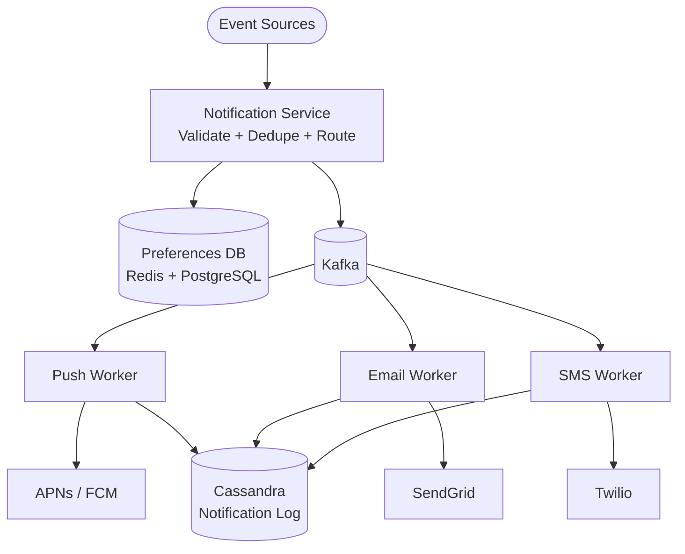

## Requirements

**Functional**:
- Send notifications via multiple channels: push (iOS/Android), SMS, email
- Support real-time and scheduled notifications
- User preferences: which channels to use per notification type (can opt out)
- Deduplication: don't send the same notification twice
- Retry on delivery failure

**Non-functional**:
- 100M daily active users
- 1B notifications/day across all channels
- Push: < 1 second delivery
- Email: < 5 minutes delivery
- SMS: < 30 seconds delivery

---

## Capacity Estimation

| Channel | Daily Volume | QPS |
|---------|-------------|-----|
| Push | 800M | 9,300 |
| Email | 150M | 1,740 |
| SMS | 50M | 580 |
| **Total** | **1B** | **~11,600** |

---

## High-Level Architecture



---

## Event Sources

Many different systems trigger notifications:

| System | Event | Notification |
|--------|-------|-------------|
| Social | New follower | "Alice followed you" |
| E-commerce | Order shipped | "Your order is on the way!" |
| Finance | Large transaction | "Unusual activity on your account" |
| Marketing | Campaign triggered | "Your cart is waiting" |

All systems send events to the Notification Service via an API or message queue.

---

## Notification Service

The notification service:
1. Receives notification request
2. Validates (required fields, valid user IDs)
3. Checks user preferences (has user opted out of this notification type?)
4. Deduplicates
5. Publishes to the appropriate channel queue (Kafka topics per channel)

```python
def send_notification(request):
    # 1. Validate
    validate(request)

    # 2. Check preferences
    prefs = get_user_preferences(request.user_id)
    channels = prefs.get_enabled_channels(request.notification_type)

    # 3. Deduplicate
    dedup_key = f"notif:{request.idempotency_key}"
    if redis.exists(dedup_key):
        return  # Already sent

    redis.setex(dedup_key, 86400, 1)  # 24h dedup window

    # 4. Route to channels
    for channel in channels:
        kafka.publish(f"notifications.{channel}", {
            "user_id": request.user_id,
            "channel": channel,
            "content": request.content,
            "notification_id": request.id
        })
```

---

## Channel Workers

Separate workers per channel. Each reads from its Kafka topic and calls the 3rd party provider.

### Push Notifications

**iOS**: Apple Push Notification Service (APNs)
**Android**: Firebase Cloud Messaging (FCM)

```python
def push_worker(message):
    user = get_user(message.user_id)
    device_tokens = get_device_tokens(user.id)

    for token in device_tokens:
        if is_ios_token(token):
            apns.send(token, message.content)
        else:
            fcm.send(token, message.content)
```

**Push token management**:
- Tokens change when app reinstalls or device is replaced
- Providers return token invalidation errors → delete stale tokens
- Users can have multiple devices → fan out to all device tokens

### Email

**Providers**: SendGrid, Amazon SES, Mailgun

```python
def email_worker(message):
    user = get_user(message.user_id)
    template = get_template(message.template_id)
    html_content = render_template(template, message.data)

    sendgrid.send(
        to=user.email,
        subject=message.subject,
        html=html_content
    )
```

### SMS

**Providers**: Twilio, AWS SNS

```python
def sms_worker(message):
    user = get_user(message.user_id)
    if not user.phone_number:
        return

    twilio.messages.create(
        to=user.phone_number,
        from_=SENDER_NUMBER,
        body=message.content[:160]  # SMS 160 char limit
    )
```

---

## User Preferences

Every user can configure:
- Global opt-out: no notifications of any kind
- Per-type opt-out: no marketing emails, but enable order updates
- Per-channel opt-out: SMS disabled, push enabled

```sql
CREATE TABLE notification_preferences (
  user_id BIGINT,
  notification_type VARCHAR(50),  -- 'marketing', 'order_update', 'social', ...
  channel VARCHAR(20),            -- 'push', 'email', 'sms'
  enabled BOOLEAN DEFAULT true,
  PRIMARY KEY (user_id, notification_type, channel)
);
```

This table is read on every notification — cache it in Redis with a short TTL.

---

## Retry and Failure Handling

Provider calls can fail (rate limits, provider outages). Handle with retry logic:

```python
def send_with_retry(provider_func, *args, max_retries=3):
    for attempt in range(max_retries):
        try:
            return provider_func(*args)
        except ProviderError as e:
            if not e.is_retryable:
                log_failure(e)
                return
            delay = 2 ** attempt  # 1s, 2s, 4s
            time.sleep(delay + random.uniform(0, 0.5))

    # After all retries: log to dead letter queue
    kafka.publish("notifications.dlq", message)
```

**Dead Letter Queue (DLQ)**: Messages that fail after all retries go to a DLQ for manual inspection or delayed retry.

---

## Notification Log

Every sent notification logged to Cassandra for:
- Audit trail
- Delivery receipt tracking
- Analytics (open rates, click rates)
- Deduplication lookups

```sql
CREATE TABLE notification_log (
  notification_id UUID,
  user_id BIGINT,
  channel VARCHAR(20),
  status VARCHAR(20),     -- 'pending', 'sent', 'delivered', 'failed'
  sent_at TIMESTAMP,
  delivered_at TIMESTAMP,
  error_message TEXT,
  PRIMARY KEY (user_id, sent_at, notification_id)
) WITH CLUSTERING ORDER BY (sent_at DESC);
```

---

## Rate Limiting

Prevent notification spam:
- Maximum 5 marketing notifications per user per day
- Maximum 1 notification per user per minute (across all channels)
- Maximum 50 SMS per user per month (cost control)

```python
def check_rate_limit(user_id, channel):
    key = f"notif_rate:{user_id}:{channel}:{date.today()}"
    count = redis.incr(key)
    if count == 1:
        redis.expire(key, 86400)  # Expires at midnight
    return count <= DAILY_LIMITS[channel]
```

---

## Fanout for Mass Notifications

For system-wide announcements (new feature launch, maintenance window):

- Can't call notification service 100M times
- **Batch dispatch**: Write job with user_id ranges, process in parallel
- **Kafka consumer groups**: Fan out across many workers

```python
# Mass notification job
def send_mass_notification(notification_template):
    # Partition users by ID range across workers
    for partition in range(NUM_PARTITIONS):
        kafka.publish("mass_notification_jobs", {
            "template_id": notification_template.id,
            "user_id_range": [partition * BATCH_SIZE, (partition+1) * BATCH_SIZE]
        })
```

---

## Trade-offs

| Decision | Trade-off |
|----------|-----------|
| Kafka per channel | Channel isolation vs more Kafka topics |
| Redis for deduplication | Memory cost vs fast dedup |
| Retry with backoff | Delayed delivery vs provider overload |
| Cassandra for log | High write throughput vs query flexibility |

---

## Interview Summary

1. **Notification Service** validates, checks preferences, deduplicates, then publishes to Kafka
2. **Per-channel workers** consume from Kafka, call 3rd party providers (APNs/FCM/SendGrid/Twilio)
3. **User preferences** cached in Redis; Cassandra for notification log
4. **Retry with exponential backoff** + dead letter queue for failures
5. **Rate limiting** per user per channel to prevent spam and control costs
