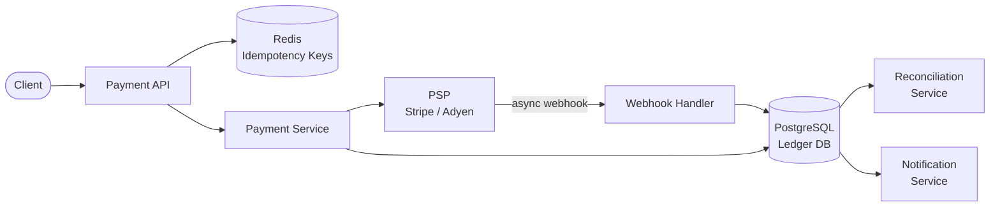

## Requirements

**Functional**:
- Accept payments from users (cards, bank accounts, wallets)
- Transfer money between accounts
- Refunds and chargebacks
- Payment history and receipts
- Multi-currency support

**Non-functional**:
- **No double charges**: Same payment must never be processed twice
- **No money lost**: Every dollar in must equal a dollar out (reconciliation)
- **High availability**: Payment system must be available 99.99%
- **Compliance**: PCI-DSS for card data, GDPR for user data, AML for large transfers

---

## Capacity Estimation

| Metric | Value |
|--------|-------|
| Transactions/day | 10M |
| Peak TPS | ~1,000 |
| Average transaction | $50 |
| Daily volume | $500M |
| Ledger records | 20M/day (2 entries per transaction) |

---

## High-Level Architecture



---

## Core Design: The Payment State Machine

A payment goes through well-defined states. Each transition is an event in the ledger.

```
INITIATED → PENDING → AUTHORIZED → CAPTURED → SETTLED
                  ↘           ↘
               FAILED      REFUNDED → REFUND_SETTLED
                                ↘
                            CHARGEBACK
```

```python
class PaymentState:
    INITIATED = "INITIATED"
    PENDING = "PENDING"          # Sent to PSP
    AUTHORIZED = "AUTHORIZED"    # PSP authorized (funds held)
    CAPTURED = "CAPTURED"        # Funds captured
    SETTLED = "SETTLED"          # Money in bank
    FAILED = "FAILED"            # PSP declined
    REFUNDED = "REFUNDED"        # Merchant refunded

VALID_TRANSITIONS = {
    "INITIATED": ["PENDING"],
    "PENDING": ["AUTHORIZED", "FAILED"],
    "AUTHORIZED": ["CAPTURED", "FAILED"],
    "CAPTURED": ["SETTLED", "REFUNDED"],
    "SETTLED": ["REFUNDED"],
}

def transition_payment(payment_id, new_state):
    payment = db.get_payment(payment_id)
    if new_state not in VALID_TRANSITIONS[payment.state]:
        raise InvalidTransition(f"{payment.state} → {new_state} not allowed")
    db.update_payment(payment_id, state=new_state)
```

---

## Idempotency: No Double Charges

**The fundamental problem**: Network failures are ambiguous. If you POST to Stripe and get a timeout — did Stripe charge the card or not? If you retry without idempotency, you might charge twice.

### Idempotency Keys

Every payment request includes an idempotency key (UUID generated by the client):

```python
def create_payment(amount, currency, payment_method, idempotency_key):
    # Check if we've seen this key before
    existing = db.get_payment_by_idempotency_key(idempotency_key)
    if existing:
        return existing  # Return exact same result as first time

    # First time: create payment record BEFORE calling PSP
    payment_id = generate_payment_id()
    db.insert_payment(
        id=payment_id,
        idempotency_key=idempotency_key,
        status=PaymentState.INITIATED,
        amount=amount,
        ...
    )

    # Call PSP
    psp_response = stripe.charge(payment_id, amount, payment_method)

    # Update payment status
    db.update_payment(payment_id, status=psp_response.status, psp_id=psp_response.id)

    return db.get_payment(payment_id)
```

**Critical**: Insert to DB before calling PSP. If we call PSP first and crash before writing to DB, we've charged the card but have no record.

---

## Double-Spend Prevention

Beyond idempotency, prevent the same funds from being spent twice:

### Account Balance Locking

When processing a payment from a user's wallet:

```sql
-- Optimistic locking approach
BEGIN;
SELECT balance, version FROM accounts WHERE id = ? FOR UPDATE;
-- Check sufficient funds
UPDATE accounts
SET balance = balance - ?, version = version + 1
WHERE id = ? AND version = ? AND balance >= ?;
-- 0 rows affected = concurrent modification, retry
COMMIT;
```

### Ledger-Based Approach (Double-Entry Bookkeeping)

Every transaction creates two ledger entries (debits and credits always balance):

```python
def transfer(from_account_id, to_account_id, amount, transaction_id):
    with db.transaction():
        # Debit sender
        db.insert_ledger_entry(
            transaction_id=transaction_id,
            account_id=from_account_id,
            entry_type="DEBIT",
            amount=-amount
        )
        # Credit recipient
        db.insert_ledger_entry(
            transaction_id=transaction_id,
            account_id=to_account_id,
            entry_type="CREDIT",
            amount=+amount
        )
        # Both entries or neither — atomically

# Account balance = SUM(amount) from all ledger entries
def get_balance(account_id):
    return db.query(
        "SELECT SUM(amount) FROM ledger_entries WHERE account_id = ?",
        account_id
    )
```

**Why ledger?** You can reconstruct any account balance at any point in time by replaying ledger entries. This is the foundation of all accounting systems (QuickBooks, banks).

---

## PSP Integration and Webhooks

Payment Service Providers (Stripe, Braintree, Adyen) are asynchronous. Authorization might not be instant.

**Pattern**: Send payment to PSP, receive confirmation via webhook.

```python
# 1. Initiate payment
stripe_intent = stripe.PaymentIntent.create(
    amount=amount,
    currency="usd",
    payment_method=payment_method_id,
    confirm=True,
    metadata={"our_payment_id": payment_id}
)

# 2. Stripe calls our webhook when status changes
@app.route('/webhooks/stripe', methods=['POST'])
def stripe_webhook():
    event = stripe.Webhook.construct_event(
        payload=request.data,
        sig_header=request.headers['Stripe-Signature'],
        secret=WEBHOOK_SECRET
    )

    if event.type == 'payment_intent.succeeded':
        payment_id = event.data.object.metadata['our_payment_id']
        db.update_payment(payment_id, status='CAPTURED')
        trigger_fulfillment(payment_id)
```

**Webhook idempotency**: Stripe may send the same webhook event more than once. Your handler must be idempotent (record processed event IDs).

---

## Reconciliation

Every day (or in real-time), reconcile your records against PSP records:

```
Our DB: 10,000 transactions totaling $500,000
Stripe report: 10,002 transactions totaling $500,100

Discrepancy! 2 transactions missing, $100 extra
→ Investigate and correct
```

```python
def reconcile_daily():
    our_transactions = db.get_settled_transactions(date=yesterday)
    psp_transactions = stripe.get_settled_transactions(date=yesterday)

    our_ids = {t.psp_id for t in our_transactions}
    psp_ids = {t.id for t in psp_transactions}

    missing_in_ours = psp_ids - our_ids
    missing_in_psp = our_ids - psp_ids

    if missing_in_ours:
        alert("Transactions in PSP not in our DB", missing_in_ours)
    if missing_in_psp:
        alert("Transactions in our DB not in PSP", missing_in_psp)
```

---

## Security and Compliance

**PCI-DSS**: Never store raw card numbers. Use PSP's tokenization (Stripe token, Braintree vault). Your system only stores tokens.

**Encryption at rest**: All payment data encrypted using envelope encryption (AWS KMS or equivalent).

**Audit log**: Every state transition and data access logged with user/service ID and timestamp.

**Fraud detection**:
- Velocity checks: > 3 failed attempts → temporary block
- Geolocation anomaly: Card used in US and EU within 1 hour
- ML-based risk scoring on transaction features

---

## Trade-offs

| Decision | Trade-off |
|----------|-----------|
| Idempotency keys | Client must generate UUIDs vs safety from double charges |
| Ledger (append-only) | Query complexity vs full auditability |
| Async PSP + webhooks | Complexity vs availability |
| Optimistic locking | Retry overhead vs high write throughput |
| Webhooks are at-least-once | Must handle duplicate events |

---

## Interview Summary

1. **Idempotency keys** on every payment request — write to DB before calling PSP
2. **Payment state machine** with valid transition enforcement
3. **Double-entry ledger** — every dollar has a debit and credit; balance is always derivable
4. **PSP webhooks** for async status updates; webhook handler must be idempotent
5. **Daily reconciliation** detects discrepancies between our records and PSP
6. **PCI-DSS**: Never store card numbers; use PSP tokenization
