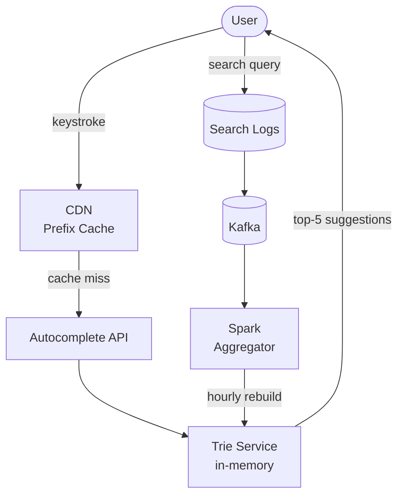

## Requirements

**Functional**:
- As the user types, show top 5 suggestions
- Suggestions ranked by search frequency
- Latency < 100ms from keystroke to suggestions displayed
- Support prefix search ("apple" matches "apple", "applesauce", "apple watch")

**Non-functional**:
- 5B searches/day (Google-scale)
- 10K QPS for autocomplete queries
- Suggestions updated with new trending queries within ~1 hour

---

## Capacity Estimation

| Metric | Value |
|--------|-------|
| Queries/day | 5B |
| Unique queries/day | ~50M |
| Average query length | 20 chars |
| Autocomplete API calls | ~10 per search = 50B/day = 580K QPS |

Wait — 580K QPS per key? That's too much to handle without aggressive caching.

**With CDN + browser caching**: Most users type the same common prefixes. CDN can cache suggestions for common prefixes (e.g., "appl" appears in millions of searches).

Realistic origin QPS after CDN: ~10K–50K QPS.

---

## Core Data Structure: Trie

A **Trie** (prefix tree) stores strings by their characters, enabling fast prefix lookups.

```
Words: ["apple", "app", "application", "apply", "appetizer"]

Trie:
  a
  └── p
      └── p (word: "app", freq: 500)
          ├── l
          │   ├── e (word: "apple", freq: 1200)
          │   │   └── t
          │   │       └── i
          │   │           └── z
          │   │               └── e
          │   │                   └── r (word: "appetizer", freq: 50)
          │   └── i (word: "apply", freq: 300)
          │       └── c
          │           └── a
          │               └── t
          │                   └── i
          │                       └── o
          │                           └── n (word: "application", freq: 800)
```

**Prefix search**: Walk the trie to the node for prefix "app", then DFS to find all words beneath. Return top 5 by frequency.

**Trie node with frequency**:
```python
class TrieNode:
    def __init__(self):
        self.children = {}
        self.is_word = False
        self.frequency = 0
        self.top_k = []  # Cache: top K queries rooted at this node
```

---

## Optimization: Cache Top-K at Each Node

Naive Trie requires DFS subtree traversal for each query. For a deep Trie, this is slow.

**Solution**: Store the top-K completions at each node. Computing this is expensive but done offline.

```
Node "app" → top5: [("apple", 1200), ("application", 800), ("app", 500), ("apply", 300), ("appetizer", 50)]
```

Now a prefix query is O(L) where L is the prefix length — just walk to the node and return the cached list.

**Trade-off**: More memory (each node stores top-K list). For a Trie with millions of nodes, this multiplies memory usage.

---

## Updating Frequency Data

Every search updates query frequencies. How do you update a distributed Trie without locking?

**Online update (naive)**: Direct update on each search. 10K QPS updating a shared data structure → heavy contention.

**Batch update (production approach)**:

1. Log all searches to Kafka
2. Hourly MapReduce / Spark job: compute top-K queries per prefix
3. Rebuild Trie from top queries
4. Swap new Trie into service (blue-green deploy)

This means suggestions lag by ~1 hour — acceptable for most use cases.

For truly real-time trending (Twitter-style), use a sliding window counter with Redis Sorted Sets.

---

## System Architecture



### Trie Storage Options

| Option | Pros | Cons |
|--------|------|------|
| **In-process memory** | Fastest reads | Can't scale horizontally without replication |
| **Redis** | Distributed, easy horizontal scale | Serialization overhead |
| **Cassandra/HBase** | Persistent, huge scale | Too slow for <100ms SLA |

**Production**: Load Trie into memory at service start. Rebuild periodically (hourly). Multiple read replicas of the Trie service for scale.

---

## Scaling the Query Load

With 10K+ QPS after CDN:

- **Shard by prefix**: Route "a-g" to shard 1, "h-n" to shard 2, "o-z" to shard 3
- **Replication**: Multiple read replicas per shard
- **CDN**: Cache responses for 60 seconds per prefix (most suggestions change slowly)

**Browser-side optimization**:
- Debounce: Only send request after user stops typing for 100ms
- Cache last N prefix responses locally in browser
- Cancel in-flight requests when user keeps typing

---

## Fuzzy Matching (Typo Tolerance)

Prefix search doesn't handle typos. "aplle" doesn't match "apple".

**Approaches**:

1. **Edit distance (Levenshtein)**: Allow matches with 1–2 character edits. Expensive to compute for every node — usually done on a smaller candidate set.

2. **Phonetic matching (Soundex, Metaphone)**: "colour" and "color" map to the same phonetic code.

3. **N-gram index**: Break queries into N-grams and find similar queries. "app" appears in "apple" and "laptop" (no) — but "appl" trigrams overlap.

4. **Elasticsearch fuzzy search**: Use Levenshtein automaton for efficient fuzzy matching at scale.

**Google's approach**: Suggests "Did you mean: apple?" using statistical language models rather than simple edit distance.

---

## Personalization

Beyond global frequency, personalize suggestions:

- Recent searches by this user (stored in client + server)
- Location-based suggestions (searching "pizza" in NYC vs LA)
- Language/locale filtering

---

## Trade-offs

| Decision | Trade-off |
|----------|-----------|
| Cached top-K per node | Memory × usage vs O(L) query speed |
| Batch Trie rebuild | 1-hour lag vs no write contention |
| CDN caching | Slightly stale suggestions vs 10× QPS reduction |
| Prefix sharding | Complex routing vs horizontal scale |

---

## Interview Summary

1. **Trie** for prefix search; cached top-K at each node for O(L) lookups
2. **Batch rebuild**: Kafka → Spark → hourly Trie regeneration, hot swap
3. **CDN** caches prefix responses for common queries; reduces origin QPS dramatically
4. **Browser debouncing** + local caching to reduce client-side QPS
5. **Personalization** layer for user history and location signals
