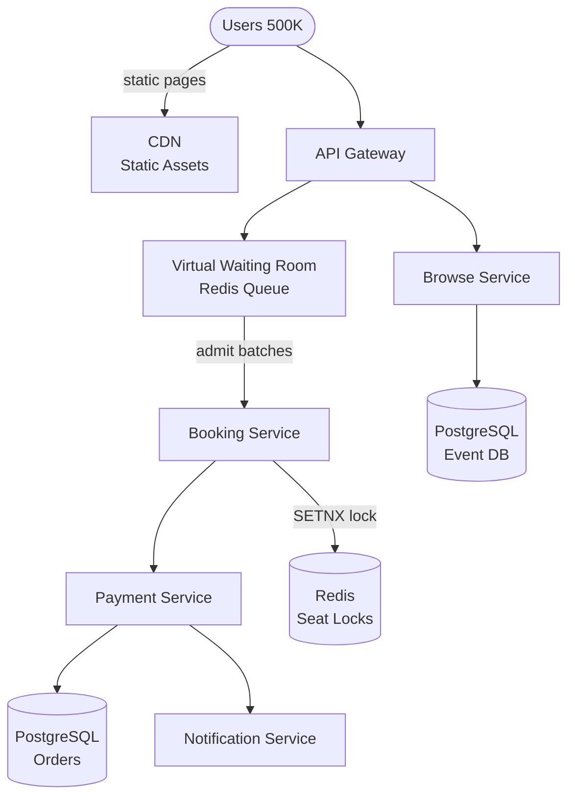

## Requirements

**Functional**:
- View events and available seats
- Select and reserve seats
- Complete purchase (payment)
- Seat maps with real-time availability
- Cancellation and refunds

**Non-functional**:
- Flash sale: 500K users competing for 10K tickets simultaneously
- No double-booking: two users must never get the same seat
- Reserve seat for 10 minutes during checkout
- 99.99% availability for browsing, 99.9% for booking

---

## Capacity Estimation

| Metric | Value |
|--------|-------|
| Peak traffic | 500K users simultaneously (flash sale) |
| Normal traffic | 10K concurrent users |
| Events/day | 5,000 |
| Tickets/event | Avg 10K, max 100K |
| Booking TPS | ~1K transactions/sec (peak) |

---

## High-Level Architecture



---

## Deep Dive: Seat Reservation — The Hard Part

The core challenge: when 500K users all try to buy the same 10K seats, how do you ensure exactly one person gets each seat?

### Option 1: Pessimistic Locking

Lock the seat row in the DB when a user selects it.

```sql
-- Transaction: lock row for update
BEGIN;
SELECT * FROM seats WHERE seat_id = 101 AND status = 'available' FOR UPDATE;
-- Row is locked until this transaction commits or rolls back

UPDATE seats SET status = 'reserved', user_id = 123, expires_at = NOW() + INTERVAL '10 min'
WHERE seat_id = 101;
COMMIT;
```

**Pros**: No race conditions, simple logic
**Cons**: At 500K concurrent users, locks pile up → massive contention → DB becomes bottleneck → timeouts cascade

### Option 2: Optimistic Locking

Don't lock. Read the current version, update only if version hasn't changed.

```sql
-- Read without lock
SELECT seat_id, status, version FROM seats WHERE seat_id = 101;
-- status = 'available', version = 5

-- Update only if version still matches
UPDATE seats
SET status = 'reserved', user_id = 123, version = version + 1
WHERE seat_id = 101 AND version = 5 AND status = 'available';

-- Check rows affected
-- 1 row affected → success
-- 0 rows affected → someone else got it first → retry or fail
```

**Pros**: No locks, high concurrency
**Cons**: High contention → many retries → wasted DB queries. Still limited by DB throughput.

### Option 3: Distributed Lock with Redis (Production Approach)

Use Redis to hold seat reservations. Atomic operations prevent race conditions.

```python
def reserve_seat(user_id, seat_id, ttl=600):
    lock_key = f"seat_lock:{seat_id}"

    # SETNX: Set if Not eXists (atomic)
    # Returns True if lock acquired, False if already locked
    acquired = redis.set(lock_key, user_id, ex=ttl, nx=True)

    if not acquired:
        return {"error": "Seat already reserved"}

    # Lock acquired — persist reservation
    db.insert_reservation(user_id, seat_id, expires_at=now() + timedelta(seconds=ttl))
    return {"success": True, "expires_in": ttl}

def complete_purchase(user_id, seat_id, payment_info):
    # Verify reservation still belongs to this user
    current_holder = redis.get(f"seat_lock:{seat_id}")
    if current_holder != str(user_id):
        return {"error": "Reservation expired"}

    # Process payment
    charge_user(user_id, payment_info)

    # Finalize seat in DB
    db.update_seat(seat_id, status='sold', user_id=user_id)
    redis.delete(f"seat_lock:{seat_id}")  # Release lock
    return {"success": True}
```

**TTL expiry**: If user abandons checkout, lock expires after 10 minutes → seat becomes available again.

---

## Virtual Waiting Room

For Taylor Swift-level demand (500K users for 10K seats), even Redis can get overwhelmed with 500K simultaneous lock attempts.

**Solution**: Virtual waiting room — admit users in batches.

```
1. All users hit "Go on sale" at the same moment
2. Server assigns each a random queue position (UUID, timestamp)
3. Users see: "You are #47,832 in the queue. Estimated wait: 8 minutes."
4. Server admits users in batches of 1,000 every 30 seconds
5. Admitted users get a booking window (15 minutes to complete purchase)
6. Users who miss their window re-enter queue
```

**Implementation**:
- Queue stored in Redis Sorted Set (score = join timestamp + random jitter)
- Queue admission: ZPOPMIN N elements every 30 seconds
- Session tokens for admitted users (JWT with expiry)

**Why random jitter?** Without it, all users who join at `t=0` have the same score → arbitrary ordering → fairness complaints.

---

## Real-Time Seat Map

Seat availability changes in real-time. Users need to see which seats are available.

**Approach**:
- Store seat status in Redis bitmap (1 bit per seat, 1=available, 0=reserved)
- Seat map page uses Server-Sent Events (SSE) to receive updates
- When seat reserved/released: publish event → SSE pushes to all viewers

```python
# Seat availability: 10K seats = 10KB of bitmap
redis.setbit(f"event:{event_id}:seats", seat_id, 0)  # Mark as reserved
redis.setbit(f"event:{event_id}:seats", seat_id, 1)  # Mark as available

# Publish availability update
redis_pubsub.publish(f"seat_updates:{event_id}", json.dumps({
    "seat_id": seat_id,
    "available": False
}))
```

For very high traffic events, rate-limit seat map updates (batch changes, send max 1 update/second per client).

---

## Preventing Queue Manipulation

- **Bot prevention**: CAPTCHA at queue entry
- **Single session per user**: Same user can't hold multiple queue positions (verified by login)
- **Device fingerprinting**: Detect multiple browsers from same IP
- **Payment verification**: Must match account name on ticket (no scalping at purchase)

---

## Data Model

```sql
CREATE TABLE seats (
  seat_id BIGINT PRIMARY KEY,
  event_id BIGINT,
  section VARCHAR(20),
  row VARCHAR(5),
  number INT,
  price DECIMAL(10,2),
  status VARCHAR(20) DEFAULT 'available',  -- 'available', 'reserved', 'sold'
  reserved_by BIGINT,
  reserved_until TIMESTAMP
);

CREATE TABLE reservations (
  reservation_id UUID PRIMARY KEY,
  user_id BIGINT,
  seat_id BIGINT,
  event_id BIGINT,
  created_at TIMESTAMP,
  expires_at TIMESTAMP,
  status VARCHAR(20)  -- 'pending', 'completed', 'expired', 'cancelled'
);

CREATE TABLE orders (
  order_id UUID PRIMARY KEY,
  user_id BIGINT,
  event_id BIGINT,
  seat_ids BIGINT[],
  amount DECIMAL(10,2),
  payment_intent_id VARCHAR(100),
  status VARCHAR(20)
);
```

---

## Trade-offs

| Decision | Trade-off |
|----------|-----------|
| Redis locks vs DB locks | Speed vs durability (Redis loses data on crash) |
| Virtual waiting room | User frustration vs fair access under load |
| Optimistic vs pessimistic locking | Throughput vs implementation simplicity |
| 10-minute reservation TTL | Short → users lose seats; Long → seats locked for long |
| SSE for seat map | Server load vs real-time accuracy |

---

## Interview Summary

1. **Redis distributed locks** for seat reservations — atomic SETNX prevents double-booking
2. **Virtual waiting room** protects backend during flash sales (500K → 1K admitted users at a time)
3. **10-minute TTL** on reservations → automatic seat release on abandoned checkout
4. **SSE** for real-time seat map updates
5. **Optimistic locking** as a DB-level safety net even with Redis locks
6. **CAPTCHA + rate limiting** at queue entry to prevent bots
