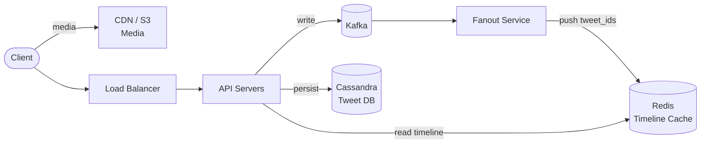

## Requirements

**Functional**:
- Users can post tweets (text, images, video)
- Users can follow other users
- Users see a timeline of tweets from people they follow (reverse-chronological)
- Users can like and retweet

**Non-functional**:
- 300M DAU, 100M tweets/day
- Timeline reads: 300K QPS, Tweet writes: 1,200 QPS
- Timelines must load in < 200ms (p99)
- Eventual consistency acceptable (1–5s lag is fine)

---

## Capacity Estimation

| Metric | Value |
|--------|-------|
| Write QPS | 1,200 tweets/sec |
| Read QPS | ~300,000 timeline reads/sec |
| Read:Write ratio | ~250:1 |
| Tweet storage (text) | ~200 bytes/tweet |
| Daily tweet storage | ~20 GB/day (text only) |
| Media storage | ~1–5 TB/day |

**Insight**: This is heavily read-dominated. Optimizing reads is paramount.

---

## High-Level Architecture



---

## Deep Dive: The Timeline Problem

The core challenge: when User A follows 500 people, their timeline is a merged, sorted stream of those 500 people's tweets. How do you serve this efficiently?

### Option 1: Fanout-on-Read (Pull Model)

When a user requests their timeline:
1. Look up all users they follow
2. Fetch recent tweets from each
3. Merge, sort, return

```
Timeline Query:
  SELECT tweet_id, user_id, content, created_at
  FROM tweets
  WHERE user_id IN (SELECT following_id FROM follows WHERE follower_id = ?)
  ORDER BY created_at DESC LIMIT 20
```

**Pros**: Simple writes (just insert tweet)
**Cons**: Extremely slow reads (fan out to hundreds of users, merge thousands of tweets)

### Option 2: Fanout-on-Write (Push Model)

When a user posts a tweet, push it to every follower's timeline cache immediately.

```
Tweet Written → Fanout Service → For each follower: add tweet_id to their Redis timeline list
```

Timeline read = just fetch the pre-built list from Redis.

**Pros**: O(1) reads (just read from Redis cache)
**Cons**: Writes are expensive. A tweet from a user with 1M followers = 1M Redis writes

### The Celebrity Problem

Fanout-on-write breaks down for celebrities (Elon Musk: 100M+ followers). Writing to 100M Redis entries per tweet would take minutes and exhaust write throughput.

**Twitter's actual solution: Hybrid Fanout**

- **Regular users** (< 1M followers): Fanout-on-write. Push tweet to all followers' Redis timelines immediately.
- **Celebrity accounts** (> threshold, e.g., 1M followers): Fanout-on-read. When a user requests their timeline, check if any of the celebrities they follow have new tweets and merge in real-time.

```python
def get_timeline(user_id):
    # 1. Get pre-built timeline from Redis (fast path)
    timeline = redis.lrange(f"timeline:{user_id}", 0, 99)

    # 2. For followed celebrities, do real-time merge
    celebrity_following = get_celebrity_follows(user_id)
    for celeb in celebrity_following:
        celeb_tweets = get_recent_tweets(celeb.user_id, limit=10)
        timeline.extend(celeb_tweets)

    # 3. Sort and return top N
    return sorted(timeline, key=lambda x: x.created_at, reverse=True)[:20]
```

---

## Data Model

```sql
-- Tweets table (sharded by user_id)
CREATE TABLE tweets (
  tweet_id BIGINT PRIMARY KEY,  -- Snowflake ID (time-ordered)
  user_id BIGINT NOT NULL,
  content VARCHAR(280),
  media_urls JSONB,
  created_at TIMESTAMP DEFAULT NOW(),
  like_count INT DEFAULT 0,
  retweet_count INT DEFAULT 0
);
CREATE INDEX idx_tweets_user_time ON tweets(user_id, created_at DESC);

-- Follows table (sharded by follower_id)
CREATE TABLE follows (
  follower_id BIGINT,
  following_id BIGINT,
  created_at TIMESTAMP,
  PRIMARY KEY (follower_id, following_id)
);
```

### Redis Timeline Cache

```
Key: timeline:{user_id}
Type: Sorted Set
Score: tweet timestamp
Value: tweet_id

# Add tweet to follower's timeline
ZADD timeline:{follower_id} {timestamp} {tweet_id}

# Keep only last 800 tweets per user
ZREMRANGEBYRANK timeline:{follower_id} 0 -801

# Read timeline
ZREVRANGE timeline:{follower_id} 0 19 WITHSCORES
```

### Tweet ID Generation

Use **Snowflake IDs** (Twitter's approach):
- 41 bits: timestamp (milliseconds since epoch)
- 10 bits: machine/datacenter ID
- 12 bits: sequence number

Benefits: globally unique, time-sortable, no central coordinator needed.

---

## Scaling the Write Path

**Kafka for fanout**: Tweets written to Kafka. Multiple fanout workers read from Kafka partitioned by user_id, write to followers' Redis timelines.

```
Tweet Service → Kafka (tweet_created topic)
                    ↓ (partitioned by author_user_id)
                Fanout Workers × N
                    ↓
                Redis Timeline Cache
```

**Fanout worker throughput**: With 1,200 tweets/sec and average 200 followers → 240,000 Redis writes/sec. This is achievable with ~20 fanout worker instances and a Redis cluster.

---

## Media Storage

Images/videos stored in S3 with CDN in front. Tweet content references media keys:

```json
{ "tweet_id": 123, "content": "...", "media": ["s3_key_1", "s3_key_2"] }
```

When serving to clients, generate CDN URLs pointing to a nearby edge server.

---

## Scaling & Trade-offs

| Decision | Trade-off |
|----------|-----------|
| Fanout-on-write for most users | Write amplification vs fast reads |
| Hybrid for celebrities | Complexity vs correctness |
| Redis for timelines | Memory cost vs read latency |
| Eventual consistency | Simplicity vs real-time accuracy |
| Snowflake IDs | Distributed generation vs sortability |

---

## Interview Summary

1. **Core problem**: 250:1 read:write ratio means optimize aggressively for reads
2. **Fanout-on-write** pre-builds timelines in Redis for fast O(1) reads
3. **Hybrid fanout** handles celebrities without scaling problems
4. **Snowflake IDs** provide time-ordered, globally unique tweet IDs
5. **Kafka** decouples tweet writes from fanout processing
6. **S3 + CDN** for media; Redis Sorted Sets for timeline cache
