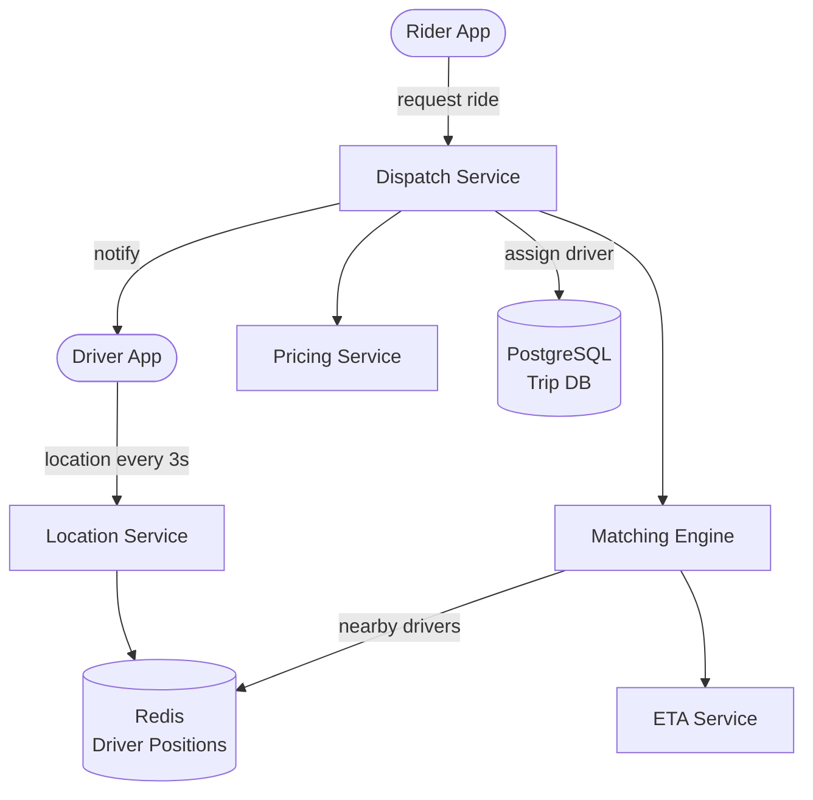

## Requirements

**Functional**:
- Riders can request a ride
- Drivers can accept/reject rides
- Real-time location tracking for drivers and riders
- Match nearest available driver to ride request
- Estimate arrival time (ETA)
- Pricing (surge pricing)

**Non-functional**:
- 15M trips/day, 6M active drivers at peak
- Driver location updated every 3 seconds
- Match driver within 5 seconds of request
- Location accuracy: < 10 meters

---

## Capacity Estimation

| Metric | Value |
|--------|-------|
| Active drivers (peak) | 6M |
| Location updates | 6M × 1/3 updates/sec = 2M location updates/sec |
| Trip requests | 15M/day ≈ 175 requests/sec |
| Location DB write throughput | ~2M writes/sec |

---

## High-Level Architecture



---

## Deep Dive: Real-Time Location Tracking

### Location Update Flow

Drivers send GPS updates every 3 seconds:

```
POST /driver/location
{ driver_id, lat, lng, timestamp, speed, heading }
```

**2M writes/sec** is too high for a traditional database. Use:
- **Redis** for current driver positions (in-memory, fast writes)
- **Cassandra** for historical location trail (analytics, receipts)

```python
# Store current driver position
redis.hset(f"driver:{driver_id}", mapping={
    "lat": lat, "lng": lng, "ts": timestamp, "status": "available"
})
redis.expire(f"driver:{driver_id}", 30)  # Expire if driver goes offline
```

---

## Geospatial Indexing

The core problem: "Find all available drivers within 5 km of a rider at coordinates (lat, lng)."

### Naive Approach (Doesn't Scale)

```sql
SELECT driver_id FROM drivers
WHERE status = 'available'
AND distance(lat, lng, driver_lat, driver_lng) < 5000
```

Full table scan of 6M drivers = way too slow.

### Approach 1: QuadTree

Recursively subdivide geographic space into 4 quadrants:

```
World
  ├── NW quadrant
  │   ├── NW-NW (small area)
  │   ├── NW-NE
  │   └── ...
  └── NE quadrant
      └── ...
```

- Subdivide until each cell has ≤ K drivers (e.g., 500 drivers per cell)
- To find nearby drivers: find the cell containing the rider's coordinates, look at that cell + adjacent cells

**Pro**: Adapts to driver density (dense areas → smaller cells)
**Con**: Updating the tree when drivers move is complex

### Approach 2: S2 Cells (Google's approach, used by Uber)

Google's S2 library maps the Earth to a cube, then recursively subdivides each face into cells at different levels.

- Level 0: 6 cells (cube faces, ~85M km² each)
- Level 12: 4M cells (~3.7 km² each)
- Level 30: 50 trillion cells (~1 cm² each)

**Key property**: Cell IDs are hierarchical integers. Level 12 cell ID contains all Level 13+ cells within it. This makes range queries efficient.

```python
# Convert lat/lng to S2 cell at level 12
cell_id = s2.CellId.from_lat_lng(s2.LatLng.from_degrees(lat, lng)).parent(level=12)

# Find nearby drivers: query cells within K rings
nearby_cells = s2.CellUnion.from_cap(
    center=s2.Cap.from_lat_lng(lat, lng, radius_km=5)
)

# Lookup drivers in those cells from Redis
for cell in nearby_cells:
    drivers = redis.smembers(f"drivers:cell:{cell.id()}")
```

**Uber's actual approach**: S2 for geospatial indexing, with driver cell membership stored in Redis sets.

### Geohash

An alternative: encode lat/lng as a base32 string. Adjacent areas share a common prefix.

```
San Francisco: 9q8yy
  9q8yy → more precise: 9q8yyu (district)
  Nearby: 9q8yyt, 9q8yyv, 9q8yy5 (prefix search)
```

**Limitation**: Boundary problem — areas near cell borders may be in completely different geohash prefixes.

---

## Driver Matching Algorithm

When a rider requests a ride:

1. Look up rider's S2 cell
2. Query nearby cells (expanding radius until N available drivers found)
3. For each candidate driver: calculate ETA (not just distance)
4. Rank by ETA (accounting for current traffic via Google Maps API or internal routing)
5. Offer to closest driver; if declined within 15 seconds, offer to next

```python
def match_driver(rider_location):
    for radius in [1, 2, 5, 10]:  # Expand search radius
        nearby_cells = get_s2_cells_in_radius(rider_location, radius_km=radius)
        drivers = get_available_drivers_in_cells(nearby_cells)
        if len(drivers) >= 3:
            break

    # Calculate ETA for top 5 candidates
    candidates = sorted(drivers, key=lambda d: haversine_distance(rider_location, d.location))[:5]
    etas = [google_maps_eta(d.location, rider_location) for d in candidates]

    # Offer to driver with best ETA
    best_driver = min(zip(candidates, etas), key=lambda x: x[1])[0]
    send_offer(best_driver.id, rider_request)
```

---

## Trip State Machine

```
REQUESTED → DRIVER_ASSIGNED → DRIVER_ARRIVING → IN_PROGRESS → COMPLETED
                                                             ↘ CANCELLED
```

Stored in PostgreSQL for ACID guarantees (payments, receipts, disputes).

---

## Surge Pricing

Surge is determined by supply/demand ratio in an area:

1. Count available drivers in area (S2 cells)
2. Count outstanding ride requests in area
3. Surge multiplier = f(demand / supply)
4. Recalculate every minute per area

---

## ETA Calculation

- **Simple**: Haversine distance / average speed — fast but inaccurate
- **Real routing**: Graph-based shortest path (Dijkstra/A*) on road network
- **Uber**: Internal routing engine on OpenStreetMap data; factors in real-time traffic

---

## Trade-offs

| Decision | Trade-off |
|----------|-----------|
| Redis for current positions | Memory cost vs 2M writes/sec throughput |
| S2 cells | Implementation complexity vs accurate range queries |
| Expanding radius search | Slightly slower vs always finding closest driver |
| Async ETA calculation | Slight latency vs not blocking match |

---

## Interview Summary

1. **Redis** stores current driver positions; Cassandra for historical trail
2. **S2 cells** (or QuadTree) for efficient geospatial queries — find drivers within radius
3. **Matching engine** expands search radius until enough candidates, then ranks by real ETA
4. **State machine** in PostgreSQL for trip lifecycle (ACID for payments)
5. **Surge pricing** computed per geo-cell based on supply/demand ratio
