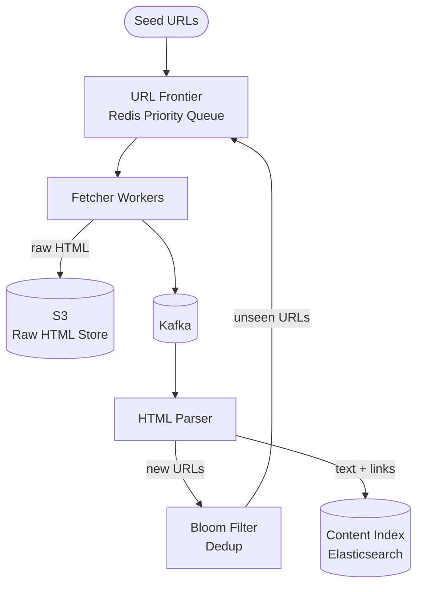

## Requirements

**Functional**:
- Crawl the entire web (billions of URLs)
- Download HTML content and store it
- Follow links to discover new pages
- Re-crawl pages periodically (freshness)
- Respect robots.txt

**Non-functional**:
- Crawl 1B pages/month
- Storage for raw HTML: ~100 TB/month
- Politeness: max 1 request/second per domain
- Deduplicate: don't crawl the same URL twice

---

## Capacity Estimation

| Metric | Value |
|--------|-------|
| Pages to crawl | 1B/month |
| Pages/sec | 1B / 2.5M sec/month ≈ 400 pages/sec |
| Average HTML size | ~100 KB |
| Storage/month | 400 × 100 KB/sec = 40 MB/sec = ~100 TB/month |
| URLs discovered | ~5B per pass (5 links per page avg) |

---

## High-Level Architecture



---

## Deep Dive: URL Frontier

The **frontier** is the queue of URLs to crawl. It's the heart of the crawler.

### Requirements for the Frontier

1. **Politeness**: Don't hammer a single domain
2. **Priority**: Crawl important pages (high PageRank) more frequently
3. **Freshness**: Re-crawl pages that change frequently
4. **Scale**: Manage billions of URLs without running out of memory

### Frontier Architecture

```
Prioritizer Queue (Redis Sorted Set, score = priority)
    ↓
Polite Queue: {domain → [URLs]} (one queue per domain)
    ↓
Fetcher picks: take 1 URL from each domain queue, rate-limited to 1/sec per domain
```

```python
def get_next_url():
    # Round-robin across domain queues with rate limiting
    for domain in available_domains():  # domains not rate-limited
        url = domain_queue.pop(domain)
        if url:
            return url, domain

def fetch_complete(url, domain):
    # Allow next fetch from this domain after 1 second
    schedule_domain_available(domain, delay=1.0)
```

---

## URL Deduplication: Bloom Filter

Problem: 5B URLs discovered per pass. Storing all in a hash set requires ~100s of GB of memory.

**Bloom filter**: A space-efficient probabilistic data structure.

- **False negatives**: Impossible — if URL was seen, Bloom filter knows it
- **False positives**: Possible — might think URL was seen when it wasn't (acceptable: skip a few pages vs crawl everything twice)
- Memory: ~10 bits per item — 5B URLs ≈ 6 GB (vs ~100 GB for a hash set)

```python
class BloomFilter:
    def __init__(self, capacity, error_rate=0.001):
        self.bit_array = bitarray(capacity)
        self.hash_functions = [...]  # Multiple hash functions

    def add(self, url):
        for hash_fn in self.hash_functions:
            idx = hash_fn(url) % len(self.bit_array)
            self.bit_array[idx] = True

    def might_contain(self, url):
        return all(
            self.bit_array[hash_fn(url) % len(self.bit_array)]
            for hash_fn in self.hash_functions
        )

# Deduplicate before adding to frontier
def add_discovered_url(url):
    if not bloom_filter.might_contain(url):
        bloom_filter.add(url)
        frontier.add(url)
    # else: possibly already crawled, skip
```

---

## Fetcher Workers

Fetchers do the actual HTTP work:

```python
def fetch_url(url, domain):
    # 1. Check robots.txt
    if not robots_checker.is_allowed(domain, url):
        return  # Respect robots exclusion

    # 2. Fetch with timeout
    response = http_get(url, timeout=10, follow_redirects=True, max_redirects=5)

    # 3. Check content type
    if "text/html" not in response.content_type:
        return  # Skip PDFs, images, etc. (or handle separately)

    # 4. Store raw HTML
    s3.put(f"raw/{hash(url)}.html", response.body)

    # 5. Publish for parsing
    kafka.publish("pages_to_parse", {url: url, content: response.body})
```

### robots.txt

Every domain has a `robots.txt` at its root:

```
User-agent: *
Disallow: /private/
Disallow: /admin/
Crawl-delay: 10

User-agent: Googlebot
Allow: /
Crawl-delay: 1
```

Cache `robots.txt` per domain (TTL = 24 hours). Don't re-fetch on every page request.

---

## HTML Parser

Extract links and content:

```python
def parse_page(url, html):
    soup = BeautifulSoup(html, 'html.parser')

    # Extract links
    links = []
    for a_tag in soup.find_all('a', href=True):
        absolute_url = resolve_url(url, a_tag['href'])
        if is_valid_url(absolute_url):
            links.append(absolute_url)

    # Extract text content
    text = soup.get_text()

    # Fingerprint for content deduplication
    content_hash = sha256(text)

    # Store parsed content
    store_page_content(url, title=soup.title.string, text=text, links=links)

    # Add discovered links to frontier
    for link in links:
        add_discovered_url(link)
```

### Content Deduplication

Avoid storing duplicate pages (mirrors, scrapers). SHA-256 hash of page content — if already seen, skip.

For near-duplicate detection (pages that are 90% identical): **SimHash** (locality-sensitive hashing).

---

## Prioritization

Not all pages are equal. Crawl order matters:

**Priority signals**:
- PageRank-like score (linked to by many pages = more important)
- Domain authority (wikipedia.org > random-blog.com)
- Page freshness (news sites change hourly, static pages rarely)
- URL structure (/page/ vs /page?session=abc123 vs very-deep/path/to/page)

```python
def calculate_priority(url, domain):
    domain_rank = get_domain_rank(domain)  # Precomputed PageRank
    recency = 1 / (hours_since_last_crawl(url) + 1)
    url_depth = url.count('/') - 2  # Deeper = lower priority

    return domain_rank * 0.5 + recency * 0.3 - url_depth * 0.2
```

---

## Distributed Crawling

400 pages/sec is too much for one machine. Distribute across workers:

- Shard URL frontier by domain hash → each worker handles specific domains
- Prevents multiple workers fetching same domain simultaneously
- Each worker maintains its own per-domain rate limit

```
Worker 1: domains starting with A–G
Worker 2: domains starting with H–N
Worker 3: domains starting with O–Z
(Actually sharded by hash for even distribution)
```

---

## Trade-offs

| Decision | Trade-off |
|----------|-----------|
| Bloom filter for dedup | ~0.1% false positive rate vs 10× memory savings |
| Per-domain polite queue | Complex scheduling vs respectful crawling |
| Kafka for parsed pages | Buffer spikes vs extra latency |
| SimHash for near-dups | Expensive to compute vs reduces storage by 30% |

---

## Interview Summary

1. **URL Frontier** with per-domain queues enforces politeness (1 req/sec/domain)
2. **Bloom filter** deduplicates 5B URLs with only 6 GB memory (vs 100s of GB for hash set)
3. **Fetchers** respect robots.txt, store HTML in S3, publish to Kafka for parsing
4. **Parser** extracts links and content, fingerprints for content dedup
5. **Priority scoring** ensures important/fresh pages crawled first
6. **Domain sharding** across workers enables distributed crawling at scale
