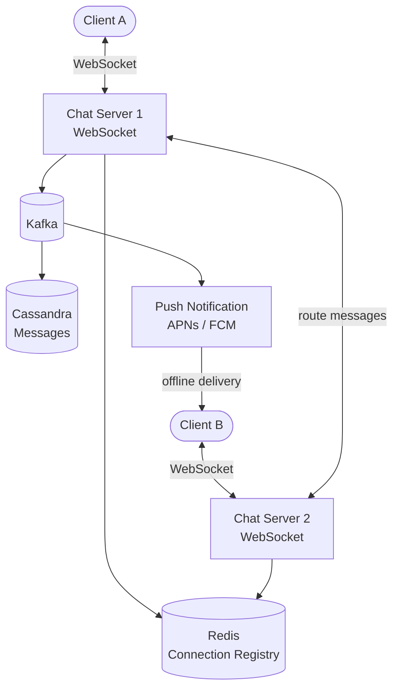

## Requirements

**Functional**:
- 1-to-1 messaging, group chats (up to 256 members)
- Message delivery receipts: sent ✓, delivered ✓✓, read ✓✓ (blue)
- Support for text, images, video, documents
- Works when recipient is offline (store-and-deliver)
- End-to-end encryption

**Non-functional**:
- 2B users, 100B messages/day
- Messages delivered in < 100ms (same region)
- 99.99% availability
- Messages never lost (durable storage)

---

## Capacity Estimation

| Metric | Value |
|--------|-------|
| Message rate | 100B/day ≈ 1.2M messages/sec |
| Active connections | ~500M concurrent |
| Message size (text) | ~100 bytes |
| Message storage | ~100 bytes × 1.2M/sec ≈ 12 GB/day |
| Media storage | Several TB/day |

---

## High-Level Architecture



---

## Deep Dive: Real-Time Messaging with WebSockets

### Why WebSockets?

Chat requires bidirectional, low-latency communication. HTTP polling wastes bandwidth. SSE is one-way. WebSockets are the right choice.

```
Client connects: ws://chat.whatsapp.com
Upgrade to WebSocket → persistent bidirectional connection
```

Each **chat server** maintains WebSocket connections for active users. Connection registry maps user_id → chat server address.

```python
# When WebSocket connects:
connection_registry.register(user_id, server_id, connection_id)

# When sending a message to user B:
server = connection_registry.lookup(user_id_B)
if server == my_server:
    send_directly(connection_id, message)
else:
    forward_to(server, message)
```

### Connection Registry

Redis stores: `user:{user_id}:server → chat_server_id`

When a user connects to Chat Server 3, record it. When another server needs to send a message to that user, it knows to route to Server 3.

---

## Message Flow

### Sending a Message

1. Alice sends message to Chat Server via WebSocket
2. Chat Server assigns message ID (Snowflake)
3. Message persisted to Cassandra (durable)
4. Chat Server looks up Bob's chat server
5. If Bob is online: forward to Bob's chat server → Bob's WebSocket
6. If Bob is offline: push notification via APNs/FCM
7. Return `sent` receipt to Alice

### Delivery Receipts

```
✓  Sent: Message reached WhatsApp servers (stored in DB)
✓✓ Delivered: Message delivered to Bob's device
✓✓ Read (blue): Bob opened the conversation
```

Bob's client sends delivery ACKs back to chat server:
```
Bob receives message → sends DELIVERED event
Bob opens chat → sends READ event for all messages in view
```

These events flow back to Alice's chat server and are forwarded to Alice via WebSocket.

---

## Message Storage: Cassandra

WhatsApp uses Cassandra for message storage. The data model:

```sql
-- Messages partitioned by conversation
CREATE TABLE messages (
  conversation_id UUID,
  message_id TIMEUUID,  -- Time-ordered UUID
  sender_id BIGINT,
  content BLOB,         -- Encrypted content
  message_type VARCHAR, -- 'text', 'image', 'video'
  status VARCHAR,       -- 'sent', 'delivered', 'read'
  created_at TIMESTAMP,
  PRIMARY KEY (conversation_id, message_id)
) WITH CLUSTERING ORDER BY (message_id DESC);
```

**Why Cassandra?**
- High write throughput (1.2M messages/sec distributed across nodes)
- Data partitioned by conversation_id → related messages on same node
- Cassandra's LSM-tree optimized for append-heavy writes
- Wide column model for time-series message data

---

## Offline Message Handling

When Bob's device is offline:
1. Message stored in Cassandra
2. Push notification sent via APNs (iOS) or FCM (Android)
3. When Bob comes online: client syncs undelivered messages

**Sync on reconnect**:
```python
# Client sends last seen message ID on reconnect
server.sync_from(user_id, last_message_id)
# Server returns all messages with ID > last_message_id
```

---

## Group Messaging

For groups with N members:
1. Message sent to group chat server
2. **Fanout**: Send to all N members
3. Individual delivery tracking per member

For small groups (< 256 members), this is manageable. Message sent to each member's WebSocket/push notification.

**Delivery receipt for groups**: "Delivered" when at least N/2 members received. "Read by X" when X members have opened it. WhatsApp shows exactly who read.

---

## End-to-End Encryption (E2EE) Architecture

WhatsApp uses the **Signal Protocol** (double ratchet algorithm).

```
Key generation:
  Alice: generates public/private key pair
  Uploads public key to WhatsApp key server

Message encryption:
  Alice: fetches Bob's public key
  Alice: derives shared secret using ECDH
  Alice: encrypts message locally with shared secret
  Alice: sends encrypted ciphertext to WhatsApp server

WhatsApp server: stores/forwards encrypted bytes — cannot read content

Bob: decrypts using his private key (never leaves device)
```

**WhatsApp never has access to message content** — this is the point of E2EE.

---

## Media Handling

Media (images, videos) not sent through WebSocket:
1. Client encrypts media locally
2. Uploads to S3 (pre-signed URL)
3. Sends message containing media URL + encryption key to recipient
4. Recipient downloads from S3, decrypts locally

---

## Scaling WebSocket Connections

500M concurrent WebSocket connections require careful engineering:

- Each chat server handles ~50K connections (limited by OS file descriptors and memory)
- ~10,000 chat servers needed globally
- **Load balancing**: Use consistent hashing on user_id to route to same server (connection affinity)

---

## Trade-offs

| Decision | Trade-off |
|----------|-----------|
| WebSockets | Stateful, complex LB vs low latency |
| Cassandra for messages | Eventual consistency vs high write throughput |
| E2EE | No server-side content moderation possible |
| Push for offline | Battery drain on mobile vs message delivery |
| Group fanout | N writes per group message vs unified storage |

---

## Interview Summary

1. **WebSockets** for persistent bidirectional connections; chat servers maintain connection registry in Redis
2. **Cassandra** for message persistence, partitioned by conversation_id
3. **Delivery receipts** via reverse ACK flow from recipient back to sender
4. **Offline handling**: Kafka queue + push notifications, sync on reconnect
5. **E2EE** using Signal Protocol — server only sees encrypted bytes
6. **Media** stored in S3 with client-side encryption
