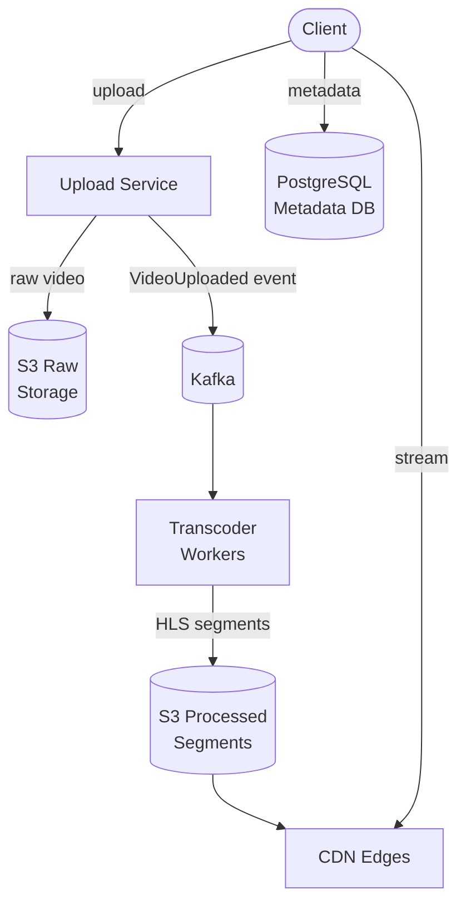

## Requirements

**Functional**:
- Users can upload videos (up to 10 GB)
- Videos available for streaming within minutes of upload
- Support multiple resolutions (360p, 720p, 1080p, 4K)
- Users can comment, like, subscribe

**Non-functional**:
- 2B+ active users, 500 hours of video uploaded per minute
- Streaming: 1B hours watched per day
- Upload latency: video available in < 5 minutes
- 99.99% availability for streaming
- Global users — must be fast worldwide

---

## Capacity Estimation

| Metric | Value |
|--------|-------|
| Upload rate | 500 hours/min ≈ 8 hours/sec of video |
| Average video size (raw) | ~2 GB per hour = 16 GB/sec incoming |
| Transcoded outputs | ~10 variants per video |
| Storage (5 years) | Petabytes |
| Streaming bandwidth | 1B hours/day × ~2 Mbps avg = ~2.3 Tb/sec |

---

## High-Level Architecture



---

## Deep Dive: Upload Pipeline

### Resumable Uploads

Large video files need resumable uploads. If connection drops at 8 GB of a 10 GB upload, starting over is unacceptable.

```
1. Client requests upload URL from API
2. API creates an upload session (UUID)
3. Client uploads chunks (e.g., 5 MB each) to Upload Service
4. Client can resume from last successful chunk
5. Upload complete → Upload Service writes to raw storage (S3)
6. Publishes VideoUploaded event to Kafka
```

**Pre-signed S3 URLs**: Skip the upload service entirely. The API returns a pre-signed S3 URL; the client uploads directly to S3. Reduces load on application servers.

### Metadata Service

Stores video metadata in PostgreSQL:
```sql
CREATE TABLE videos (
  video_id VARCHAR(11) PRIMARY KEY,  -- YouTube's 11-char ID
  uploader_id BIGINT,
  title VARCHAR(100),
  description TEXT,
  status VARCHAR(20),  -- 'uploading', 'processing', 'ready', 'failed'
  created_at TIMESTAMP,
  raw_storage_key TEXT,
  duration_seconds INT
);
```

---

## Deep Dive: Transcoding

YouTube generates multiple quality variants of every video. Transcoding is the most compute-intensive part of the pipeline.

### Why Multiple Formats?

- Users have different bandwidth (mobile on 3G vs home fiber)
- Different devices support different codecs (H.264, H.265/HEVC, VP9, AV1)
- **Adaptive bitrate streaming** (ABR): Player switches quality in real-time based on available bandwidth

### Transcoding Pipeline

```
Raw video (1080p, H.264)
    ↓ Transcoder Workers (parallel)
    ├── 4K HDR (H.265)
    ├── 1080p (H.264 + VP9)
    ├── 720p (H.264 + VP9)
    ├── 480p (H.264 + VP9)
    ├── 360p (H.264)
    └── 144p (H.264)
    ↓
All variants stored in S3
```

### Parallel Transcoding

Split video into segments, transcode in parallel:

```
Video → Split into 10-second segments
              ↓ (each segment transcoded by a separate worker)
Worker 1: seg1.mp4 → [1080p, 720p, 480p, ...]
Worker 2: seg2.mp4 → [1080p, 720p, 480p, ...]
...
              ↓ (concatenate)
Final video: All resolutions
```

YouTube can transcode a 1-hour video in a few minutes this way.

### Worker Queue

```
Kafka topic: transcode_jobs
  Partitioned by video_id
  Workers (autoscaled EC2 instances) read from topic
  Each worker handles one segment
```

---

## Adaptive Bitrate Streaming: HLS and DASH

### HLS (HTTP Live Streaming) — Apple's standard

Video split into segments, with a manifest file listing all segments and quality levels:

```
master.m3u8 (manifest):
  #EXT-X-STREAM-INF:BANDWIDTH=5000000,RESOLUTION=1920x1080
  1080p/playlist.m3u8
  #EXT-X-STREAM-INF:BANDWIDTH=2000000,RESOLUTION=1280x720
  720p/playlist.m3u8
  #EXT-X-STREAM-INF:BANDWIDTH=800000,RESOLUTION=854x480
  480p/playlist.m3u8

1080p/playlist.m3u8:
  #EXTINF:10.0,
  seg_001.ts
  seg_002.ts
  seg_003.ts
  ...
```

The player:
1. Downloads `master.m3u8` to know available quality levels
2. Selects quality based on current bandwidth
3. Downloads and plays segments continuously
4. Switches quality level when bandwidth changes

### DASH (Dynamic Adaptive Streaming over HTTP) — MPEG standard

Similar to HLS but codec-agnostic (supports VP9, H.265). Used by YouTube, Netflix.

### CDN Segment Caching

Each segment (`.ts` or `.m4s` file) is a static URL — perfect for CDN caching:

```
https://cdn.youtube.com/video/{video_id}/1080p/seg_001.ts
Cache-Control: public, max-age=31536000, immutable
```

Segments never change once created → cache indefinitely.

---

## Video Storage Architecture

```
Raw uploads: S3 (temp bucket, lifecycle to delete after transcoding)
Transcoded: S3 (permanent, multiple AZs)
  └── replicated to regional buckets for CDN origin

CDN (CloudFront/Akamai): Cache segments near users
  └── Video thumbnails: separate CDN path
  └── Popular segments: cached at all edges
  └── Long-tail: cache on demand
```

---

## Streaming Optimization

**Preloading**: When video starts, immediately fetch first few segments at lower quality. Upgrade quality once player has buffer.

**Thumbnail sprites**: A single image containing multiple thumbnail frames. Browser downloads once, player scrubs to any position.

**Server-Sent Events** for live streaming: HLS Low-Latency extension (LL-HLS) enables ~2 second delay for live content.

---

## Search and Recommendations

**Search**: YouTube uses Elasticsearch for video search. Videos indexed on title, description, tags, auto-generated captions.

**Recommendations**: Machine learning model (YouTube's paper: "Deep Neural Networks for YouTube Recommendations"). Candidate generation + ranking. Outside scope of infrastructure design.

---

## Trade-offs

| Decision | Trade-off |
|----------|-----------|
| Async transcoding | Videos not instantly available, but don't block upload |
| Multiple formats | High storage cost (10× raw) vs broad device support |
| CDN for segments | High CDN cost vs fast global streaming |
| Segment-based HLS | Slight latency vs live, but infinite scalability |
| Pre-signed S3 uploads | No upload server needed vs less control |

---

## Interview Summary

1. **Resumable upload** with chunking; direct S3 upload via pre-signed URLs
2. **Async transcoding**: Kafka triggers workers, parallel segment transcoding
3. **HLS/DASH** for adaptive bitrate streaming — player adjusts quality dynamically
4. **S3 + CloudFront**: Video segments cached at CDN edges globally
5. **Metadata DB**: PostgreSQL for video state machine (uploading → processing → ready)
