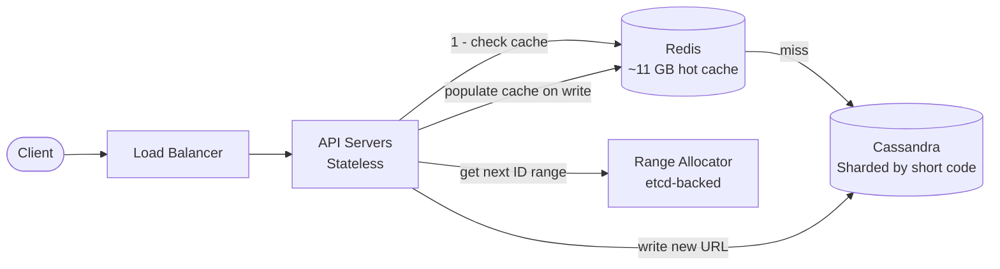

## Requirements

**Functional:**
- Given a long URL, generate a short URL (e.g. `short.ly/aB3kPq`)
- Redirect short URL to original long URL
- Optional: custom aliases (`short.ly/my-brand`)
- Optional: URL expiration with configurable TTL

**Non-functional:**
- 100M URLs stored, growing at 55K new URLs/day
- Read-heavy: 100:1 read-to-write ratio — optimize for redirects
- Redirect latency: < 10ms p99
- 99.99% availability — a broken redirect is a broken link for millions of users
- Short codes must be globally unique — two URLs must never share a code

**Out of scope:** User accounts, analytics dashboard, link preview cards.

---

## Capacity Estimation

| Metric | Calculation | Result |
|--------|-------------|--------|
| Write QPS | 55K URLs/day ÷ 86,400 | **~0.64 writes/sec** |
| Read QPS (avg) | 0.64 × 100 (read ratio) | **~64 reads/sec** |
| Peak read QPS | 64 × 10 (viral link spikes) | **~640 reads/sec** |
| Storage per URL | 500B (long URL) + 50B (metadata) | **~550 bytes** |
| Total storage (100M URLs) | 100M × 550B | **~55 GB** |
| Cache for hot 20% | 20M × 550B | **~11 GB** |
| Read bandwidth | 640 RPS × 500B | **~320 KB/s** |

**Key insight:** Write load is trivially small (< 1 QPS). The entire design centers on making reads — redirects — as fast as possible. Everything else is secondary.

---

## High-Level Architecture



---

## Deep Dive: Short Code Generation

This is the most interesting part. We need codes that are **short**, **unique**, and **fast to generate** without coordination on every request.

### Why not random strings?

```python
# Bad: random generation
import secrets, string
code = ''.join(secrets.choice(string.ascii_letters + string.digits) for _ in range(7))
# Problem: must check DB for collision on EVERY generation
# At scale: 100M URLs → birthday problem → ~1.5% collision rate at 7 chars
# Each collision = extra DB round-trip + retry
```

Random generation forces a DB lookup to verify uniqueness on every write. At scale, collision retries pile up. **Reject this.**

### Why not MD5/SHA hash of the URL?

```python
# Bad: hash the URL
import hashlib
h = hashlib.md5(long_url.encode()).hexdigest()[:7]  # e.g. "1a2b3c4"
```

Two problems:
1. **Same URL → same code** — user shortens the same URL twice and gets the same short code. Do we return the existing entry or create a new one? Either answer has annoying edge cases.
2. **Still needs collision check** — different long URLs can hash to the same 7-char prefix. Still requires a DB lookup.

**Reject this.**

### The right answer: Counter → Base62 encoding

Every URL gets a unique integer ID from a counter. Encode that integer in Base62 (`a-z A-Z 0-9`).

```python
BASE62_CHARS = "abcdefghijklmnopqrstuvwxyzABCDEFGHIJKLMNOPQRSTUVWXYZ0123456789"

def to_base62(n: int) -> str:
    if n == 0:
        return BASE62_CHARS[0]
    result = []
    while n:
        result.append(BASE62_CHARS[n % 62])
        n //= 62
    return ''.join(reversed(result))

to_base62(1)          # → "b"
to_base62(1_000_000)  # → "4c92"
to_base62(3_521_614_606_208)  # → "zzzzzz" (max 6 chars)
```

**Why Base62?**
- Base62 is URL-safe — no `+`, `/`, `=` like Base64 which break in URLs
- 6 chars = 62^6 = **56.8 billion unique codes** — enough for centuries at our write rate
- Pure deterministic math — no DB lookup needed, **zero collision probability**

**Why a counter and not a hash?**
A counter gives you a monotonically increasing integer. Encode it to Base62 and you're done. No collisions, no lookups, no retries.

### The distributed counter problem

A single counter is a single point of failure. The solution: **range-based pre-allocation**.

```
etcd holds the global counter: currently at 5,000,000

Server A starts up:
  → Asks etcd for a range: "give me 1,000 IDs"
  → etcd atomically advances counter to 5,001,000
  → etcd returns range [5,000,000, 5,001,000)
  → Server A now generates IDs 5,000,000 to 5,000,999 locally — no network round-trips

Server B starts up simultaneously:
  → Gets range [5,001,000, 5,002,000)
  → Zero conflict with Server A
```

```python
import threading

class RangeAllocator:
    RANGE_SIZE = 1000

    def __init__(self, etcd_client):
        self.etcd = etcd_client
        self.lock = threading.Lock()
        self._fetch_new_range()  # Fetch on startup

    def _fetch_new_range(self):
        # etcd compare-and-swap: atomically increment global counter
        start = self.etcd.atomic_increment("global_counter", self.RANGE_SIZE)
        self.current = start
        self.end = start + self.RANGE_SIZE

    def next_id(self) -> int:
        with self.lock:  # Thread-safe within one server
            if self.current >= self.end:
                self._fetch_new_range()
            id = self.current
            self.current += 1
            return id
```

**Why etcd (not a DB row)?**
- etcd uses the Raft consensus algorithm — writes are linearizable. No two servers can get overlapping ranges even under network partitions.
- A DB row with `SELECT FOR UPDATE` would work but adds latency and becomes a write bottleneck under high concurrency. etcd's atomic increment is purpose-built for this.

**Why a range of 1,000?**
Each server needs only 1 etcd round-trip per 1,000 URLs it shortens. At 0.64 writes/sec globally, this means one etcd call every ~25 minutes per server. Negligible overhead.

---

## Deep Dive: The Redirect Path

This is the **hot path** — every click on a short URL hits this. It must be as fast as possible.

### 302 vs 301 — a critical decision

This is one of the most commonly confused points in URL shortener design.

| Code | Meaning | Browser behaviour | Analytics impact |
|------|---------|-------------------|-----------------|
| **301** Moved Permanently | The resource has permanently moved | Browser caches the redirect forever — **never hits your server again** | You lose all click data after first visit |
| **302** Found (Temporary) | The resource is temporarily at this location | Browser re-requests every time | **You see every click** |

**Use 302.** Always.

The entire value of bit.ly, TinyURL, and every production URL shortener is **analytics** — knowing how many clicks, from where, on what device. A 301 redirect destroys this: after the first click, the browser goes directly to the destination and your service is bypassed forever.

The "SEO transfer" argument for 301 doesn't apply here — the short URL is not a web page competing for search rankings.

### Redirect flow

```python
def redirect(short_code: str):
    # Step 1: Check Redis cache (~0.1ms)
    long_url = cache.get(f"url:{short_code}")

    if long_url is None:
        # Step 2: Cache miss — query Cassandra (~5ms)
        row = db.execute("SELECT long_url, expires_at FROM urls WHERE code = ?", short_code)

        if row is None:
            raise NotFound()

        # Step 3: Check expiration
        if row.expires_at and row.expires_at < now():
            raise Gone()  # HTTP 410 — existed but expired (not 404)

        long_url = row.long_url
        ttl = seconds_until(row.expires_at) if row.expires_at else 86400
        cache.set(f"url:{short_code}", long_url, ex=ttl)

    # Step 4: Record click asynchronously (fire-and-forget)
    analytics_queue.publish({"code": short_code, "ts": now(), "ip": request.ip})

    # Step 5: Redirect
    return Response(status=302, headers={"Location": long_url})
```

**Why 410 and not 404 for expired URLs?**
404 means "this resource never existed." 410 means "it existed but has been removed." An expired URL *did* exist — 410 is semantically correct and tells clients (and search engine crawlers) not to retry.

**Why record clicks asynchronously?**
The redirect itself must be fast — the user is waiting for the page. Writing a click event synchronously adds a DB write to every redirect. Instead, publish to a Kafka topic. A separate analytics worker processes events in bulk at its own pace. The redirect returns in < 2ms; the click gets recorded eventually.

---

## Deep Dive: Caching Strategy

With ~640 peak read QPS, caching is our primary performance lever.

### Cache-aside (lazy population)

We use the cache-aside pattern (also called lazy loading):

1. Check Redis first
2. On miss: query Cassandra, populate Redis, return result
3. On hit: return from Redis directly

**Why not write-through?** Write-through populates the cache on every write regardless of whether the URL will ever be read. We have 100M URLs but only ~20M are ever actively accessed. Write-through wastes memory on URLs no one clicks. Cache-aside only caches what's actually accessed.

### Cache key and TTL

```
Key: "url:{short_code}"         → e.g. "url:aB3kPq"
Value: long URL string
TTL: min(URL expiration, 24h)   → expires before the URL does
```

**Why TTL = min(expiration, 24h)?** If a URL expires in 6 hours, don't cache it for 24 — the redirect would serve a stale (expired) URL. If no expiration is set, 24 hours is a reasonable refresh window.

### Cache sizing

Top 20% of URLs receive ~80% of traffic (Pareto principle). That's 20M URLs × 550 bytes ≈ **11 GB of Redis**. A single Redis instance handles this comfortably with headroom.

When to scale to Redis Cluster: when your hot working set exceeds a single node's memory, or when reads exceed ~100K QPS (Redis single-node limit).

---

## Data Model

A URL shortener is essentially a key-value store. The data is simple:

```
short_code (partition key) → long_url, created_at, expires_at, user_id
```

### Why Cassandra and not PostgreSQL?

| Criteria | PostgreSQL | Cassandra |
|----------|-----------|-----------|
| Access pattern | Read by short_code (single key) | Read by short_code (single key) |
| Writes | Fine at 1 QPS | Overkill |
| Horizontal scale | Manual sharding, complex | Built-in, add nodes |
| Joins / complex queries | Full SQL support | No joins |
| Operational simplicity | Simpler for small scale | More to operate |

The access pattern is pure key lookup — `WHERE code = ?`. There are no JOINs, no ORDER BY across the table, no aggregates. This is exactly what Cassandra optimizes for, and it scales horizontally without any manual sharding work on our part.

**But for a small deployment:** PostgreSQL is completely fine. The read volume (640 QPS) is trivial for Postgres with an index on `short_code`. Use Postgres until you actually need scale, then migrate. Don't over-engineer day one.

### Schema

```sql
-- Cassandra
CREATE TABLE urls (
    short_code  TEXT,
    long_url    TEXT,
    created_at  TIMESTAMP,
    expires_at  TIMESTAMP,   -- NULL means no expiration
    user_id     UUID,        -- NULL means anonymous
    PRIMARY KEY (short_code)
);

-- Index for "show me all URLs this user created"
CREATE TABLE urls_by_user (
    user_id     UUID,
    created_at  TIMESTAMP,
    short_code  TEXT,
    long_url    TEXT,
    PRIMARY KEY (user_id, created_at)
) WITH CLUSTERING ORDER BY (created_at DESC);
```

**Why a separate `urls_by_user` table?**
Cassandra doesn't support secondary indexes efficiently at scale. To query "all URLs for user X", we'd need to scatter-gather across all nodes. The solution is a second table denormalized by user_id. This is normal in Cassandra — model your tables around your query patterns.

---

## Handling Edge Cases

### Custom aliases

When a user requests `short.ly/my-brand`:

1. Check if `my-brand` already exists in the DB
2. If it exists and belongs to a **different** user → return `409 Conflict`
3. If it exists and belongs to **the same** user → allow update (idempotent re-creation)
4. If it doesn't exist → create it without going through the counter service (custom code bypasses ID generation)

### Malicious URL filtering

Check against a blocklist before shortening:

```python
def validate_url(long_url: str):
    domain = extract_domain(long_url)
    if blocklist.is_blocked(domain):
        raise BadRequest("URL contains a blocked domain")
    # Optional: async check against Google Safe Browsing API
```

The blocklist lives in Redis (fast lookups, easy updates). Additions are propagated within seconds via Redis replication.

### Hot links (viral URLs)

A URL that goes viral can hit 100K+ clicks per second. This exhausts even a single Redis cache if all requests hit the same key on the same shard.

**Solution:** For URLs with detected high QPS, replicate the cache entry to a local in-process LRU cache on each API server:

```python
# L1: per-process LRU (1ms, free)
# L2: Redis (1ms, network)
# L3: Cassandra (5ms, disk)

local_cache = LRUCache(max_size=1000, ttl_seconds=5)

def get_url(code):
    url = local_cache.get(code)  # L1 hit
    if url: return url
    url = redis.get(f"url:{code}")  # L2 hit
    if url:
        local_cache.set(code, url)
        return url
    # L3: Cassandra
    ...
```

A 5-second TTL on the local cache is acceptable — URLs don't change. This drops Redis traffic by 10–100× for viral links.

---

## Scaling

| Component | Current headroom | When to scale | How |
|-----------|-----------------|---------------|-----|
| API Servers | Stateless, add nodes freely | CPU > 70% | Horizontal: add more behind LB |
| Redis Cache | ~11 GB working set | Memory > 80% | Redis Cluster (shard by key hash) |
| Cassandra | Handles TB+ | Node disk > 70% | Add more Cassandra nodes (auto-rebalance) |
| Range Allocator | etcd handles 10K ops/sec | Never (0.64 writes/sec) | Not a concern |

---

## Trade-offs

| Decision | What we chose | Why | What we gave up |
|----------|-------------|-----|----------------|
| ID generation | Counter + Base62 | Zero collisions, no DB lookup needed | Sequential IDs are guessable (minor) |
| Redirect code | 302 | Every click is tracked | Marginally more server load vs 301 (cached) |
| Database | Cassandra | Horizontal scale, perfect key-value fit | No SQL joins, more ops complexity |
| Caching | Cache-aside | Only caches accessed URLs, saves memory | Cold-start latency on first access |
| Click tracking | Async via Kafka | Redirect stays < 2ms | Analytics lag by a few seconds |
| Expired URL response | 410 Gone | Semantically correct | Slightly more complex than always-404 |

---

## Interview Summary

1. **Base62 counter** — convert a monotonically increasing integer to Base62. Zero collisions, zero DB lookups. Counter distributed via etcd range allocation.

2. **Always 302** — 301 gets cached by browsers permanently, killing click analytics. 302 ensures every redirect hits your server.

3. **Redis cache-aside** — top 20% of URLs cached in ~11 GB of Redis. Cache TTL respects URL expiration. Viral URLs get an additional in-process L1 cache.

4. **Cassandra** — pure key-value access pattern fits Cassandra perfectly. Scales horizontally without manual sharding. Use PostgreSQL for smaller scale.

5. **Async click tracking** — redirect returns in < 2ms, Kafka worker records analytics separately.

6. **410 vs 404** — expired URLs return 410 (existed and was removed), not 404 (never existed). Semantically correct and tells crawlers not to retry.
